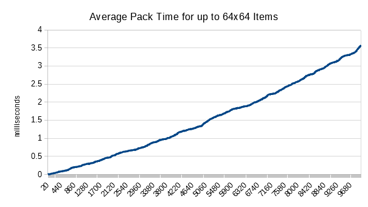
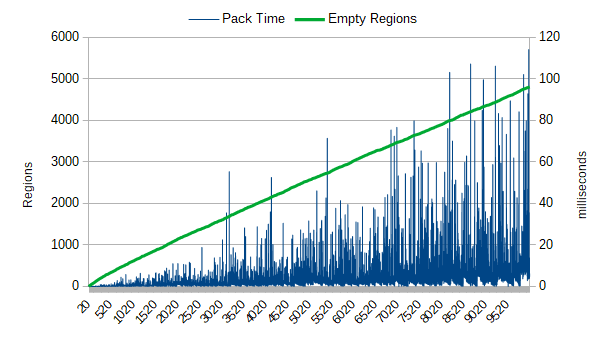
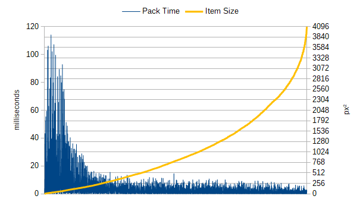
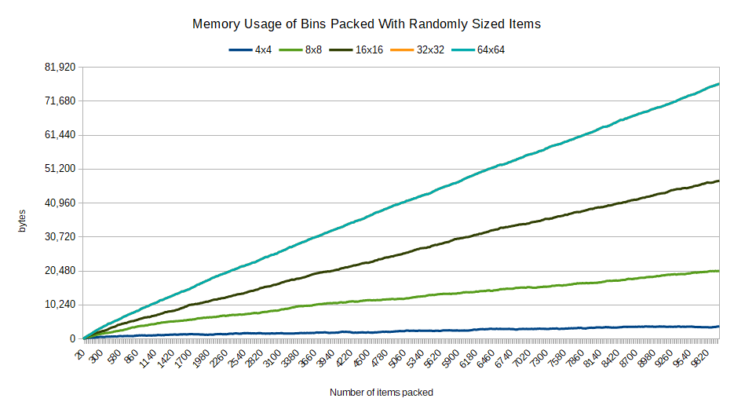
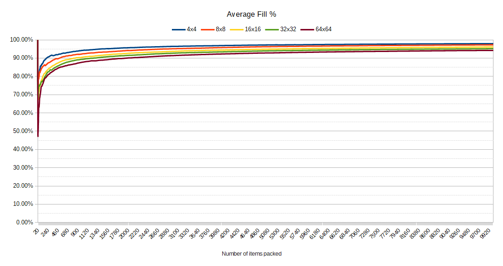
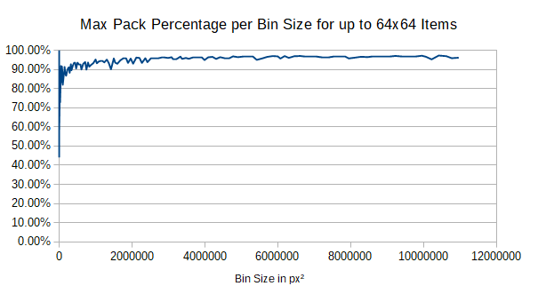

# Tiny Fast 2D Bin Packer
This software is a simple yet fast and memory-efficient 2D bin packing algorithm, useful for dynamic font atlas generation and only 200 lines of code.


## Usage
Here is an example of basic usage without any application.
```c++
using BinPacker;

Bin bin;
bin.ExtendDimensions({128, 128});

Area itemSize = {40, 30};
Rect result = bin.TryPackArea(itemSize);
if (result.IsValid())
{
	bool rotated = itemSize.width != itemSize.height && result.right - result.left + 1 == itemSize.height;
	cout << "Item has been packed at (" << result.left << ',' << result.top << ")"
		" with a width of " << (result.right - result.left + 1) << " and a height of " << (result.bottom - result.top + 1)
		<< rotated ? " and has been rotated 90-degrees.\n" : ".\n";
}
else
{
	cout << "Bin packing failed. Bin is too small.\n";
}
```

Here is an example of how a font atlas may be generated.
```c++
class FontAtlas
{
	Bin bin;
	Texture texture;
	Font font;
	map<wchar_t, Glyph> glyphs;
	
	public:
		Glyph GetGlyph(wchar_t c)
		{
			auto i = glyph.find(c);
			// If the glyph isn't already loaded, load and pack it to the texture.
			if (i == glyph.end())
			{
				auto fontGlyph = font.LoadChar(c);
				Rect packed = bin.TryPackArea({fontGlyph.width, fontGlyph.height});
				while (!packed.IsValid())
				{
					Area dimensions = bin.GetDimensions();
					dimensions = { max(128, dimensions.width), max(128, dimensions.height) };
					bin.ExtendDimensions(dimensions);
					texture.Resize(dimensions.width, dimensions.height);
					packed = bin.TryPackArea({fontGlyph.width, fontGlyph.height});
				}
				unsigned int width = packed.right - packed.left + 1;
				unsigned int height = packed.bottom - packed.top + 1;
				bool rotated = width != height && width == fontGlyph.height;
				texture.BufferSubImage(packed.left, packed.top, width, height, rotated ? rotate(fontGlyph.bitmap) : fontGlyph.bitmap);
				Glyph newGlyph = { fontGlyph.advanceX, fontGlyph.advanceY, packed.left, packed.top, packed.right, packed.bottom, rotated };
				glyphs.emplace(c, newGlyph);
				
				return newGlyph;
			}
			else
			{
				return *i;
			}
		}
};
```

## How the algorithm works
The algorithm is self-devised and involves recording the empty space within the bin as a collection of rectangles.
Items that are packed are not recorded which allows for tens of thousands of items to be packed with very little memory being consumed.
When an item is attempted to be packed, every empty region large enough to fit the item will evaluate it's position in each corner
of the empty region and also in a 90-degree rotated orientation. The evaluated position and orientation is scored based
on how many empty regions will be clipped by the item and how many new empty regions will result if any.
This score is scaled by the area of the resulting empty space thereby minimizing the amount of space left behind and effectively
maximizing the amount of space filled at the same time.
The prospective position with the lowest score will be the position into which the item will be packed.
When the item is packed, any intersecting empty regions will be removed and replaced with new empty regions surrounding the packed item.
Resulting empty regions after an item is packed will be merged with existing empty regions whenever possible to reduce memory usage.


## Performance
Performance was measured based on how fast items could be packed into an dynamically expanding bin with items varying in size from 1x1 up to 4x4, 8x8, 16x16, 32x32, and 64x64.
The below results were measured single-threaded on Windows 10 with an AMD Ryzen 7 3700X 8-Core processor.

### Speed
When packing 10,000 items randomly sized from 1x1 to 64x64 in a dynamically expanding bin, the average packing time ranges from 0ms to about 3.5ms as given by the following graph.



The average time is linear based on the number inserted due to the number of empty regions that results after so many randomly sized items are packed.
The actual deviation can be seen in the below graph.



This deviation is due to two factors, the number of empty regions and the size of the item being packed.
Larger items are easier to pack because there are fewer empty regions that can accomodate the larger item, resulting in fewer overall comparisons.
This also explains why smaller items have a greater deviation of packing times, because when there are few empty regions the items are packed relatively quickly,
but as the number of empty regions increase, the number of potential placement candidates increase, thus increasing the number of comparisons required for placing a smaller item.



### Memory Usage
The amount of empty space varies depending on the size of the items being packed.
Smaller items have less permutations and can therefore be packed more tightly within a bin, while items with greater variation in size tend to leave more gaps.
Since this algorithm relies on storing only empty spaces, then the memory usage increases when more empty regions appear.
Each empty region stores 16 bytes of memory, 4 bytes each for the left, top, right, and bottom positions of the empty region.
The following graph demonstrates the memory usage of inserting randomly sized items varying from 1x1 to 4x4, 8x8, 16x16, 32x32, and 64x64,
and by association the amount of empty regions per number of packed items per size variation.
For bins that only store up to 1000 items, the memory usage will be up to 10KB for items ranging up to 64x64 in size, or under 1KB for items ranging up to 4x4.
After 10,000 items have been inserted, memory usage ranges up to 75KB for items ranging up to 64x64 in size or under 5KB for items ranging up to 4x4.



### Efficiency
The efficiency of the packing can be measured by the percentage of the bin being full.
When randomly sized items are inserted into the bin the efficiency will be dependent on the amount of variation in size.
As with the previous measurements, smaller items with less variation are able to be packed tighter and more efficiently occupy empty space
while larger items with more variation tend to leave more gaps.
The below graph shows the average amount of empty space as more items are inserted (up to 10,000) with items of varying sizes.



This graph shows only the average packing efficiency which is somewhere between when the bin size is increased, leaving the most amount of empty space available,
and when the bin is full enough to not be able to pack a new item without first resizing.
The following graph demonstrates for items sized randomly between 1x1 and 64x64 the max fill percentage based on the bin size.


